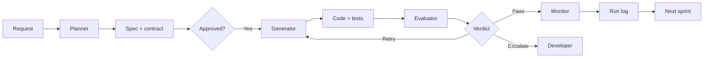

# Harness Design Brief

This brief covers the main design choices behind the StoreOps agentic harness. It explains 
- how a feature gets broken into sprint contracts, 
- how the harness protects the architecture, 
- how the Evaluator turns unpredictable LLM output into a clear pass or fail, and 
- why certain decisions were made.

## Section A — Intent Decomposition

### How a feature gets broken into sprint contracts

- The Planner splits work into small sprint contracts that are easy to build and easy to review. The default rule is one endpoint per sprint — one route, one service method, one repository method, related types, and tests. If a change stays inside one module and doesn't need a new route, it can still be its own sprint as long as it's small.

- If a feature touches multiple modules, it gets split into separate sprints with a specific order too. A module that provides data gets built before the module that depends on it. That's why "SLA breach alerting" was split into three sprints instead of one big change — first `programmes` got read-only lookup support, then `activities` got the SLA evaluation logic, then `alerts` handled the notification step.

- This is a practical rule. If one sprint would touch more than about three non-test files, it gets split. Smaller changes are easier for the Generator to write correctly and easier for the Evaluator to review with specific evidence. The harness relies on file-level review, so keeping changes small makes the whole thing more reliable.

### How acceptance criteria are written

Each acceptance criterion uses GIVEN/WHEN/THEN format. This makes requirements easier to test and easier to review. The goal is that each criterion maps to a real test, not a vague statement.

"The feature works correctly" is too vague — different people will read that differently. e.g. "the endpoint rejects only the forbidden items and still updates the valid items from the list" is concrete. A test can prove whether that happened or not.

This structure also helps the Generator and Evaluator. The Generator can point to the test that covers each criterion, and the Evaluator can check whether that claim holds up.

### Example sprint contract entry

Here's one real example from `sprint-1-contract.md`:

> **AC4: task ownership is enforced per item**
> GIVEN a caller attempts to update tasks they do not own and a manager-level override is not in
> effect for that task
> WHEN the bulk request includes those tasks
> THEN the endpoint rejects only those items with a `FORBIDDEN` response and continues processing
> the remaining valid tasks instead of failing the entire batch.

This is a good example because it leads directly to a test. The test can check that the forbidden task appears in the failed list and that valid tasks still appear in the updated list. There's not much room for interpretation.

## Section B — Governance Framework

### How skill files are organized

The harness uses different skill files for different jobs. Some are shared across all agents, and some are only used by one. This keeps instructions focused and avoids overloading any one agent.

The shared files make sure every agent starts with the same understanding of the system:

| File | Read by | Purpose |
|---|---|---|
| `app-context.md` | All agents | Describes the real state of the StoreOps app — which modules and endpoints exist, which routers are intentionally excluded, and where placeholder behavior still exists. Stops agents from guessing. |
| `architecture-principles.md` | All agents | Defines the non-negotiable StoreOps rules — module boundaries, event-bus-only side effects, the `AppError` contract, layer separation, and reports being read-only. |
| `sprint-decomposition.md` | Planner | Tells the Planner how to size work and how to write useful sprint contracts and acceptance criteria. |
| `coding-conventions.md` and `how-to-test.md` | Generator | Tells the Generator how code and tests should look in this repo — module-level singletons, `reset()` for tests, and the mirrored `tests/storeops/` structure. |
| `how-to-review.md` and `grading-criteria.md` | Evaluator | Defines how to review changes, which commands to run, how to score the result, and which hard gates can never be ignored. |

This split matters because StoreOps has rules specific to this repository. A generic Python style guide wouldn't be enough. Agents need project-specific instructions to produce and review work consistently.

The two most important shared files are `app-context.md` and `architecture-principles.md`. If the Generator and Evaluator were working from different assumptions, the verdicts would stop making sense.

### How the `.harness/reviews/` folder works as an audit trail

The `.harness/reviews/` folder is the permanent record of what happened during a run. The main file there is `run-log.md`, which the Monitor updates after each sprint.

That log records:

1. The sprint ID.
2. The final verdict.
3. How many iterations were used.
4. Whether escalation happened.
5. Estimated token usage.
6. Notes about repeated quality issues.

This file is committed to the repo and anyone (developers, reviewers etc.) can take look to understand past harness behavior. It also helps surface repeated problems. 
The Monitor flags issues that show up across three or more sprints so they can be turned into better skill guidance later. 

### Key architecture rule and what breaks without it

One important rule in `architecture-principles.md` is that cross-module side effects must go through `storeops.shared.events.event_bus.emit()`. A module should not directly import another module's service just to trigger a write.

This rule protects module boundaries. Without it, a Generator trying to satisfy a requirement quickly would call another service directly — it's the shortest path. That would often work in the short term, and the code might even pass tests. But it creates tighter coupling between modules, which makes the system harder to maintain over time.

This exact problem came up in sprint-4.2. The first attempt had `programmes.service` calling `activities.service.create_activity()` directly. That solved the immediate requirement but broke the architecture rule. The Evaluator caught it, marked the item as AMBIGUOUS, and the next iteration fixed it properly — emitting an event and reading the result through a read-only path. That kept the modules properly separated.

## Section C — Non-Determinism Strategy

### Evaluation dimensions and why they're weighted this way

The Evaluator scores work across three dimensions:

1. **Architecture Compliance (40%)**
2. **Correctness & Coverage (40%)**
3. **Process Integrity (20%)**

Architecture Compliance and Correctness & Coverage are weighted highest because they matter most. If the architecture starts to erode, every future sprint becomes harder to trust. If a feature is wrong but still passes through the loop, the harness has failed at its main job.

Process Integrity still matters, but it's weighted lower. It checks whether the loop itself is being followed honestly — did the Generator report its changes clearly, is the evaluation based on real evidence. That's important, but it's secondary to whether the code is correct and follows the architecture.

### Hard gates and what each one prevents

Some checks are hard gates. They're not open to interpretation — if a hard gate fails, the sprint cannot pass.

The main hard gates are:

1. `lint-imports` must pass. This prevents module-boundary violations from being waved through as a one-time exception. If this became a soft check, the structural rules would slowly become meaningless.
2. No raw `raise Exception`, `ValueError`, `RuntimeError`, or `TypeError` in `routes.py` or `service.py`. This protects the `AppError` contract so the app keeps one consistent error handling path.
3. `pytest` must pass and `check_coverage.py` must pass for the touched layer. This prevents the harness from handing off broken or poorly tested code.
4. `generator-summary.md` must exist and include the expected self-check information. This prevents the Evaluator from reviewing unsupported claims or incomplete handoff notes.

Each hard gate blocks a specific failure mode. The goal is to remove as much subjectivity as possible from the most important checks.

### How variable Generator output becomes a consistent verdict

The Generator's wording can vary from run to run, but the final verdict should not. The harness achieves this by tying the result to hard gates and checklist outcomes — not to style or tone.

Sprint-1 is a good example. In the re-evaluation:

1. All hard gates passed.
2. `lint-imports` passed.
3. No forbidden raw exceptions were found.
4. `pytest` passed with 100 tests.
5. Coverage passed for the touched layers.
6. The architecture checklist passed.
7. The correctness checklist passed, with one observation noted about a test only checking part of the audit-entry contract.
8. The process checklist passed.

That produced a weighted score above the PASS threshold. Because there were no unresolved AMBIGUOUS items and no failed hard gates, the verdict was a clear PASS.

The key point is that two different models could write the review comments very differently and still reach the same verdict. The result comes from the check outcomes, not from how convincing the prose sounds.

### Escalation path

The escalation rule is straightforward. If the same sprint fails three times in a row, the harness stops retrying automatically.

At that point, the orchestrator writes `.harness/output/escalation.md` with:

1. The sprint ID.
2. The iteration count.
3. The exact blocking issue copied from the final `evaluator-feedback.md`.

That file goes back to the developer. This is where a person steps in. The harness does not try a fourth automatic fix. That keeps the loop from running forever and makes escalation a clear handoff point rather than a vague fallback.

## Section D — Architectural Decisions

### Decision 1: Use the event bus for cross-module side effects

**The decision**
Cross-module side effects must go through the event bus. Direct service-to-service calls are only allowed for read-only behavior.

**Alternatives considered**
One option was to allow direct service calls for both reads and writes. Another was to build a more complex message queue or persistent event system.

**Rationale**
Allowing direct service-to-service writes would be simpler in the short term, but it would weaken module boundaries. A full queue-based system would be too heavy for this in-memory demo app. The in-process event bus gives enough separation without adding infrastructure the project doesn't need.

**Assumption**
This assumes the app stays single-instance and in-memory. If it later grows into a multi-instance system with real persistence, the event design would need to change.

### Decision 2: Give each agent turn a fresh, bounded context

**The decision**
Each Planner, Generator, and Evaluator turn starts fresh and reads only the files it needs.

**Alternatives considered**
One option was to keep one long conversation for the full run. Another was to keep a rolling summary of earlier sprints.

**Rationale**
A long conversation grows too large over time and makes later turns less reliable. It also weakens the independence of the Evaluator — if the Evaluator sees the Generator's own reasoning, it might follow that reasoning instead of checking the actual code and tool output. A fresh context keeps each review more independent and easier to reproduce.

**Assumption**
This depends on the handoff files being complete. If something important is only said in a chat turn and never written into a file, later turns won't see it.

### Decision 3: Use PASS / FAIL / AMBIGUOUS instead of just PASS / FAIL

**The decision**
The Evaluator can mark checklist items as PASS, FAIL, or AMBIGUOUS, rather than forcing every case into one of two buckets.

**Alternatives considered**
One option was a simple PASS/FAIL system. Another was to let AMBIGUOUS count as partial credit.

**Rationale**
Binary scoring sounds simpler, but it handles uncertain cases poorly. Some things aren't clear violations, but they're not strong enough to count as a pass either. Letting AMBIGUOUS count as partial credit would make it too easy for uncertain work to quietly drift into a passing score. The current model keeps ambiguity visible without pretending it's good enough.

**Assumption**
This works best if someone actually reviews the Monitor notes and follows up on repeated AMBIGUOUS cases. The system can highlight uncertainty, but it still takes a person to act on that signal.
